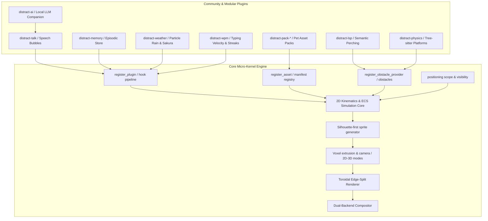

# `distract.nvim` — Ecosystem Roadmap

**Nothing here is a missing feature of this plugin.** Every core surface these
designs need is built, tested and documented; each section below is a *separate
repository* built on top of them. Nothing here adds a file under `lua/distract/`.

- **What this plugin does** — [`README.md`](../README.md) and `:help distract`.
- **What was built and why** — [`CHANGELOG.md`](../CHANGELOG.md).
- **The design of what shipped** — [`../doc/distract.txt`](../doc/distract.txt),
  which is the reference for every contract these plugins build against.
- **Open in-repo work** — [`HANDOFF.md`](../HANDOFF.md).

Working reference plugins for both extension surfaces are in
[`examples/plugins/`](../examples/plugins/). If a section below cannot be written
against what they demonstrate, that is a gap in the core and belongs in
`HANDOFF.md` rather than here.

The one exception, and the only in-repo work this file names: §2.7's
`validate_sprite_parity` wants the comparator extracted into
`engine/src/sprite_parity.rs` so an MCP server can call it without reimplementing
the tolerance rules.

---

## 1. Architecture as it now stands



The surfaces every section below is built on:

| Surface | Entry point | Documented at |
|---|---|---|
| Lifecycle hooks | `register_plugin(name, hooks)` | `:help distract-plugins` |
| Solid ground and hazards | `register_obstacle_provider(fn)` | `:help distract-obstacles` |
| Custom art and manifests | `register_asset(name, spec)` | `:help distract-custom-art` |
| Where sprites may be | `positioning.scope` | `:help distract-positioning` |
| Flat or voxel drawing | `render.mode`, manifest `render` | `:help distract-render` |

---

## 2. Ecosystem plugins

### 2.1 Contextual Dialogue & Speech Bubbles (`distract-talk`)

- **Objective:** floating dialogue balloons above companions with contextual tips,
  banter and reactions.
- **Bubble art:**
  ```
     ╭────────────────────────────╮
     │ Hope you're writing tests? │
     ╰────────────╮───────────────╯
                  ▼
             /\_/\   (Cat Sprite)
            ( o.o )
  ```
- **Triggers:**
  - `on_save_untested`: file saved with no matching test file (`*_spec.lua`,
    `*_test.go`, `*.test.ts`).
  - `on_git_churn`: high editing velocity with repeated undos/deletions.
  - `on_long_idle`: friendly reminder after 15 minutes of inactivity.
  - `on_lsp_error`: reaction to a diagnostic spike.
- **Built on:** `on_draw`, which reports where every sprite was actually drawn in
  terminal cells on every backend — that is the geometry a bubble has to avoid
  colliding with. `positioning.blocking_rects` is the same question for the
  editor's own furniture. The bubble must never cover the cursor line,
  `pumvisible()`, or a floating window.
- **Exposes:** `say(entity_id, text, opts)` — §2.6 streams into it. Text is
  wrapped and length-bounded; an unbounded model response is a DoS on the
  renderer.
- **Declare `render = "2d"` on the bubble's manifest.** A speech balloon is flat
  furniture and reads as nothing else; without the pin it would be extruded into a
  slab in a 3D session. The pin wins over the configuration, and the flat pass
  composites over the model pass, so a flat bubble above a voxel pet needs nothing
  else. See `:help distract-render`.

---

### 2.2 Persistent Episodic Memory (`distract-memory`)

- **Objective:** privacy-first storage of editing sessions, language exposure and
  milestones, so companions can reference history.
- **Storage:** `vim.fn.stdpath("data") .. "/distract/memory.json"`
- **Schema:**
  ```json
  {
    "version": 1,
    "history": {
      "first_seen_timestamp": 1773000000,
      "last_session_timestamp": 1773598000,
      "total_sessions": 24,
      "languages_spoken": {
        "lua": { "file_count": 42, "last_edited": 1773598000 },
        "rust": { "file_count": 18, "last_edited": 1773590000 }
      },
      "milestones": [
        { "id": "first_rust_file", "achieved_at": 1773590000 },
        { "id": "marathon_session_3h", "achieved_at": 1773500000 }
      ]
    }
  }
  ```
- **Contextual greetings:** *"It's been 12 days! Welcome back."* / *"Oh, I've never
  seen you write Rust before!"* / *"You've been hacking for 3 hours, remember to
  hydrate!"*
- **Built on:** `on_init` and `on_teardown` for the session boundary,
  `on_editor_event` for language exposure.
- **Constraints:** no file paths and no file contents ever enter the store —
  language names and counts only. Atomic write (temp + rename). A `version` bump
  gets a migration function, not a runtime branch. `milestones` and
  `languages_spoken` are capped. Time is injected, never read inside logic.

---

### 2.3 Semantic LSP Pathfinding & Companion Accompaniment (`distract-lsp`)

- Query `textDocument/documentSymbol` for function headers, classes and structs as
  perch points, registered as `solid_platform` rectangles through
  `register_obstacle_provider`.
- **4-quadrant spatial planner:** score Top-Right, Direct-Right, Direct-Left and
  Bottom-Right for non-occlusion against the cursor line, diagnostic underlines and
  `pumvisible()`.
- **Diagnostic reactions:** error spikes trigger startled states through
  `world.request_state`; the cat leaps, the crab snaps its pincers defensively.
- Requests are async and cancellable; a request in flight when the buffer changes is
  cancelled, not awaited. A missing LSP client is empty data, not failure — no warning.
- **Note:** the provider cadence is already debounced by the core, so this must
  not add a second debounce of its own.

---

### 2.4 Tree-sitter Code Physics & Solid Platforms (`distract-physics`)

- Tree-sitter detects function headers, markdown dividers (`---`) and closed folds.
- Each becomes a `solid_platform` rectangle through `register_obstacle_provider`.
- The cat or crab walks across function definitions and falls between indented gaps.
- Fold state and buffer edits invalidate the cache. A missing parser is a no-op.
- **Start from** [`examples/plugins/headers_as_platforms.lua`](../examples/plugins/headers_as_platforms.lua),
  which is this with a Lua pattern where the query should be. The core caps the
  list at 128 rectangles, so a query over a large file needs narrowing rather
  than trusting.

---

### 2.5 Ambient Weather & Particle Systems (`distract-weather`)

- 🌧️ **Rain & thunderstorms:** density scales with git diff size; lightning on
  syntax errors.
- 🌸 **Falling sakura petals:** drift responds to scroll momentum.
- ❄️ **Snow accumulation:** flakes settle on the statusline or bottom divider.
- 💻 **Matrix digital rain:** falling katakana/alphanumeric glyphs for focus sessions.

**The blocking question is answered: this can be a plugin.** `engine/tests/tick_budget.rs`
and `tools/bench_tick.lua` measured it. 200 entities cost **0.074 ms** per tick in
the overlay — 0.4% of a 60 FPS frame in a debug build — and **4.0 ms** per frame
stepped and drawn in the terminal, 12% of a 30 FPS frame. Both scale linearly, and
a settled world costs almost nothing because the redraw guard skips it. The
in-terminal ceiling is around 500 moving entities (63% of a frame), well past what
rain needs on screen. No batched particle path in the core is required; re-run the
benchmark before assuming that still holds.

Particles must respect the positioning scope and the toroidal wrap, both of which
they get for free by being entities.

**In a 3D session particles are extruded too**, which is usually what you want for
snow and sakura and never what you want for matrix rain. Pin the flat ones with
`render = "2d"` per manifest rather than assuming the session's mode. Re-measure
with `tools/bench_render3d.lua` before scaling a 3D particle count: the per-draw
cost is the same as 2D once a pose is cached, but every distinct particle *pose*
is rasterised once, so a system with many one-off frames pays repeatedly where a
pet does not.

---

### 2.6 Local LLM Companion Brain (`distract-ai`)

- **Objective:** connect companions to local lightweight models (SmolLM, Qwen 2.5
  0.5B, Ollama) for pair-programming comments.
- **Workflow:** on test failure or diagnostic burst, pass a concise prompt plus
  error snippet to the local endpoint; stream a one-sentence response into §2.1's
  bubble; fully offline, non-blocking, via `vim.uv`.
- **Hard requirements:**
  - **Local endpoint only.** A configured non-localhost endpoint is refused at
    startup with an explicit error. No hosted API, no key handling, no telemetry.
  - **Off by default, explicit opt-in.** Sending code to any model is the user's
    decision.
  - **Prompt is bounded and redacted.** An error snippet, not the buffer. Character
    cap documented. File paths never sent.
  - **Failure is silence.** Endpoint down, model missing or timeout produces no
    bubble, one `WARN`, and no retry storm.
  - **Output truncated** at a documented length before it reaches the bubble.

---

### 2.7 Asset Generation MCP Server (`distract-sprite-craft`)

Tooling for agents and developers building procedural sprites. Runs standalone
without Neovim.

- `create_sprite_asset` — generate pose curves, shading parameters, a manifest.
- `validate_sprite_parity` — **wraps the existing harness; does not reimplement
  it.** The comparison contract is the golden format in `tests/fixtures/sprites/`
  plus the two tolerance rules and per-asset budgets documented in
  `tests/sprite_parity_spec.lua`. Extracting the comparator into
  `engine/src/sprite_parity.rs` is the work; re-deriving the rules is not.
- `validate_voxel_parity` — the same, over `tests/fixtures/voxels/`, and simpler:
  that harness has no tolerance at all, so the comparison is equality on the
  emitted vertex list. Worth exposing separately because a generated sprite is also
  a generated *model*, and an asset that reads well flat can still mesh badly.
- `preview_sprite_terminal` — half-block ANSI frames into the agent console.
  [`tools/preview_sprite.lua`](../tools/preview_sprite.lua) is the text-only version
  of this and is what the art redo was judged with.

---

### 2.8 Gamification, WPM Momentum & Streaks (`distract-wpm`)

- **Hypersprint:** sustained 80+ WPM makes the sprite sprint with a particle trail.
  No longer gated on anything: §2.5's measurement clears the particle question.
- **Pomodoro pet:** focus pose during work sprints, celebration animation on
  completion.
- WPM is computed from an injected clock over a rolling `TextChangedI` window,
  which arrives as `on_editor_event("typing", …)`.

---

## 3. Roadmap

Every core dependency is built, so all eight repositories can now start in
parallel. The ordering below is by how much each one teaches the others, not by
what blocks what.

```
+-----------------------------------------------------------------------------------------------+
| FIRST: the two that prove the surfaces at product scale                                       |
| - distract-talk   (on_draw + occlusion: the hardest placement problem)                        |
| - distract-physics (obstacle provider with a real Tree-sitter query)                           |
+-----------------------------------------------------------------------------------------------+
                                                │
                                                ▼
+-----------------------------------------------------------------------------------------------+
| THEN: the ones that build on those                                                            |
| - distract-lsp (perch points + the 4-quadrant planner, on top of talk's occlusion work)       |
| - distract-memory   - distract-wpm   - distract-weather                                       |
+-----------------------------------------------------------------------------------------------+
                                                │
                                                ▼
+-----------------------------------------------------------------------------------------------+
| LAST: the ones with an external dependency                                                    |
| - distract-ai (a local model)   - distract-sprite-craft (an MCP host)                          |
+-----------------------------------------------------------------------------------------------+
```
