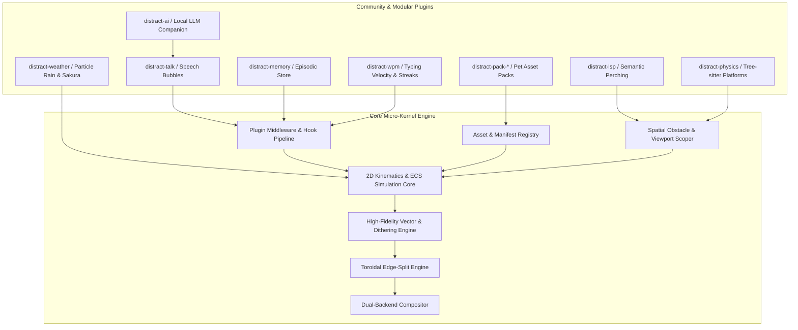

# `distract.nvim` — Future Feature Roadmap & Architecture Specification

This document details the architectural evolution, micro-kernel plugin design, high-fidelity asset rendering models, technical trade-offs, and implementation specifications for the next generation of features in `distract.nvim`.

---

## 1. Strategic Architecture: The Micro-Kernel Core & Plugin Ecosystem

To ensure high performance, zero startup latency (<1ms), and uncompromised maintainability, `distract.nvim` adopts a **Micro-Kernel Engine Architecture**. The core repository remains focused on high-speed 2D sprite simulation, physics integration, sub-pixel vector shading, and dual-backend compositing, while domain-specific features (LSP integration, speech dialogue, episodic memory, weather systems, and AI companion logic) are implemented via a structured **Plugin & Middleware API**.



---

## 2. Core Micro-Kernel Extension APIs

The core engine provides four primary extension points allowing modular plugins to hook into simulation ticks, asset registries, rendering passes, and spatial obstacle systems.

### 2.1 Dynamic Asset Provider API
Allows community pet packs to be installed as standalone plugins or loaded at runtime without touching core code:
```lua
local distract = require("distract")

distract.register_asset("dragon", {
  manifest = require("distract-dragons.manifest"),
  sprites = require("distract-dragons.sprites"),
})
```

### 2.2 Middleware & Lifecycle Hook Pipeline
Plugins can subscribe to engine lifecycle events, mutate simulation state, intercept state transitions, or inject custom rendering layers:
```lua
distract.register_plugin("my-plugin", {
  --- Called once when the plugin is registered or engine starts
  on_init = function(world) end,

  --- Called every simulation tick (30/60 FPS)
  --- @param entity table live entity state
  --- @param dt number delta time in seconds
  on_tick = function(entity, dt) end,

  --- Called when an entity transitions between states
  --- @param entity table
  --- @param from_state string
  --- @param to_state string
  on_state_change = function(entity, from_state, to_state) end,

  --- Called when an entity hits screen boundaries or solid obstacles
  --- @param entity table
  --- @param collision_info table { edge = "top"|"bottom"|"left"|"right"|"obstacle", target = table|nil }
  on_collision = function(entity, collision_info) end,

  --- Called when editor autocommands fire (debounced)
  --- @param event_name string "typing"|"moving"|"scrolling"|"idle"
  --- @param context table { cursor_col = number, cursor_row = number, buf = number }
  on_editor_event = function(event_name, context) end,

  --- Called when engine is stopped or reset
  on_teardown = function() end,
})
```

### 2.3 Spatial Obstacle & Solid Platform Provider
Allows plugins (such as Tree-sitter physics or LSP symbol perching) to register physical solid bounding boxes for entities to land on, walk across, or avoid:
```lua
distract.register_obstacle_provider(function(win_id, buf_id)
  return {
    { x = 10, y = 15, width = 40, height = 1, type = "solid_platform" },
    { x = 0,  y = 25, width = 80, height = 1, type = "hazard" },
  }
end)
```

---

## 3. High-Fidelity Vector-Grade Shading & Sub-Pixel Asset Pipeline

### 3.1 Objective: Emoji-Grade Clarity with SVG Precision
Sprites are designed to be **compact, iconic, and readable at small sizes** (like Apple/Fluent vector emojis) while retaining razor-sharp subpixel fidelity:
- High contrast, recognizable silhouettes that don't overwhelm editor text.
- Continuous analytical mathematical shading ($r = \sqrt{x^2+y^2}$, Lambertian normals, smoothstep anti-aliasing) rather than noisy manual pixel clusters.
- Seamless multi-point lighting, dithering, and micro-detail primitives.

### 3.2 Multi-Point Lighting & Ordered Bayer Dithering
- **Lighting Model**:
  $$\text{Color} = \text{Ambient} + \text{Key}_{\text{diffuse}} + \text{Fill}_{\text{warm bounce}} + \text{Rim}_{\text{cool grazing}} + \text{Specular}_{\text{glint}}$$
- **$4 \times 4$ Bayer Matrix Dithering**: Softens spherical illumination transitions on retro pixel surfaces to prevent flat color stepping:
  $$M_4 = \frac{1}{16} \begin{bmatrix} 0 & 8 & 2 & 10 \\ 12 & 4 & 14 & 6 \\ 3 & 11 & 1 & 9 \\ 15 & 7 & 13 & 5 \end{bmatrix} - 0.5$$

### 3.3 Vector Micro-Detail Primitives
- **`spark(cx, cy, radius, color)`**: 4-pointed specular flare stars for claw snaps and solar eclipse diamond-rings.
- **`arc(cx, cy, rx, ry, start_angle, end_angle, color)`**: Continuous parametric curve rasterizer for solar coronal loops and facial curves.
- **Whiskers & Eyestalk Catchlights**: Delicate subpixel lines with pupil dilation and eye glint reflections.

### 3.4 Built-In High-Fidelity Asset Specifications

| Asset | Internal Dimensions | Visual Characteristics & Fidelity Details |
|---|---|---|
| 🐱 **Cat** | $24 \times 16$ px | • Inner ear blush tinting & upright ear geometry<br>• Sparkling cyan/emerald eyes with white catchlight reflections<br>• Delicate anti-aliased whiskers extending from muzzle<br>• Multi-source warm bounce fill & cool rim lighting<br>• Dynamic tail inertia curve & sleeping Zzz fade |
| 🦀 **Crab** | $24 \times 16$ px | • High-gloss ruby-red carapace with specular glints<br>• Animated eyestalks with pupils and catchlight highlights<br>• Articulated pincer claws with gold snap sparkle flashes<br>• Sandy burrow mounds with cosine particle variations |
| ☀️ **Sun** | $16 \times 16$ px | • Smooth radial Lambertian sphere with hot radiant core<br>• Pulsing magnetic coronal loops and spinning solar prominence rays<br>• Totality diamond-ring flare sparkle on solar eclipse<br>• Sunrise/sunset atmospheric horizon bands |

---

## 4. Core Engine Enhancements

### 4.1 Buffer-Constrained & Scoped Viewport Positioning
- **Objective**: Constrain sprite movement strictly to the text area of the currently active buffer window, avoiding overlap with floating popups (LSP hover, Telescope, which-key, completion menus) and embedded terminal splits.
- **Configuration API**:
  ```lua
  require("distract").setup({
    positioning = {
      scope = "buffer", -- "buffer" | "window" | "editor" | "absolute"
      exclude_floating = true,
      exclude_filetypes = { "toggleterm", "lazy", "TelescopePrompt", "fzf", "help" },
      z_index_offset = 40, -- Lower than LSP hover/cmp (50+)
    },
  })
  ```
- **Implementation**:
  - **In-Terminal ([`lua/distract/renderer.lua`](file:///Users/igmrrf/Desktop/packages/distract.nvim/lua/distract/renderer.lua))**: Query window rect with `vim.api.nvim_win_get_position()` and `nvim_win_get_width()`, binding floating windows via `relative = "win"`.
  - **Overlay ([`engine/src/ecs.rs`](file:///Users/igmrrf/Desktop/packages/distract.nvim/engine/src/ecs.rs))**: Synchronize viewport clipping rectangles over JSON-RPC via `UpdateViewportScope`.

---

### 4.2 Multi-Directional & Parametric Kinematics Engine
- **Objective**: Support 2D parametric motion vectors for all entity types:
  - **Sun**: Omnidirectional free-floating drift, Lissajous curves, circular solar orbits.
  - **Crab**: Lateral scuttle with vertical burrowing depth vectors.
  - **Cat**: 2D planar leaping, ballistic gravity arcs, and diagonal mouse/cursor chasing.
- **Manifest Kinematics Schema**:
  ```lua
  states = {
    orbital_drift = {
      physics = {
        locomotion = "omnidirectional",
        max_speed = 3.0,
        path_type = "lissajous", -- "linear" | "sine" | "lissajous" | "bezier" | "orbital"
        path_params = {
          freq_x = 1.0,
          freq_y = 2.0,
          amp_x = 40.0,
          amp_y = 20.0,
          phase_delta = math.pi / 4,
        },
      },
    },
    diagonal_pounce = {
      physics = {
        locomotion = "ballistic",
        target_vx = 3.5,
        target_vy = -2.8,
        gravity = 0.25,
        terminal_velocity_y = 6.0,
      },
    },
  }
  ```

---

### 4.3 Seamless Toroidal Edge-Splitting & Continuous Screen Wrap
- **Objective**: When any portion of a sprite crosses an edge (top, bottom, left, or right), the sliced portion that leaves the screen is **simultaneously rendered on the opposite boundary** at the exact complementary coordinate, producing smooth, continuous toroidal wrapping with zero visual popping.
- **Visual Mechanics**:
  ```
         Top Edge (y = 0)
     ┌───────────────────────┐
     │       ▲  (Lower 70% of sprite visible at top)
     │     ( o.o )           │
     │                       │  <--- Editor Viewport
     │                       │
     │      /\_/\            │
     │       ▼  (Upper 30% of sprite simultaneously appears at bottom)
     └───────────────────────┘
       Bottom Edge (y = lines)
  ```
- **Implementation**:
  - **In-Terminal ([`lua/distract/renderer.lua`](file:///Users/igmrrf/Desktop/packages/distract.nvim/lua/distract/renderer.lua))**: Allocates an ephemeral secondary floating window (`active_windows[id .. "_wrap"]`), dynamically slicing line strings and highlights between the top and bottom offsets.
  - **GPU Overlay ([`engine/src/gpu.rs`](file:///Users/igmrrf/Desktop/packages/distract.nvim/engine/src/gpu.rs))**: Detects bounding quad intersections and emits two or four `SpriteInstance` quads with scaled UV coordinates in a **single instanced draw call**.

---

## 5. Ecosystem Plugins & Advanced Features

### 5.1 Contextual Dialogue & Speech Bubble Subsystem (`distract-talk`)
- **Objective**: Render clean floating dialogue balloons above companions with contextual tips, banter, and reactions.
- **Bubble ASCII Art**:
  ```
     ╭────────────────────────────╮
     │ Hope you're writing tests? │
     ╰────────────╮───────────────╯
                  ▼
             /\_/\   (Cat Sprite)
            ( o.o )
  ```
- **Trigger Triggers**:
  - `on_save_untested`: File saved without matching test file (`*_spec.lua`, `*_test.go`, `*.test.ts`).
  - `on_git_churn`: High editing velocity with repeated undos/deletions.
  - `on_long_idle`: Friendly reminder after 15 minutes of inactivity.
  - `on_lsp_error`: Humorous reaction to compiler/linter error spikes.

---

### 5.2 Persistent Episodic Memory Engine (`distract-memory`)
- **Objective**: Persistent, privacy-first storage tracking editing sessions, language exposure, and milestones so companions can reference historical events.
- **Storage Location**: `vim.fn.stdpath("data") .. "/distract/memory.json"`
- **Schema**:
  ```json
  {
    "version": 1,
    "history": {
      "first_seen_timestamp": 1773000000,
      "last_session_timestamp": 1773598000,
      "total_sessions": 24,
      "languages_spoken": {
        "lua": { "file_count": 42, "last_edited": 1773598000 },
        "rust": { "file_count": 18, "last_edited": 1773590000 }
      },
      "milestones": [
        { "id": "first_rust_file", "achieved_at": 1773590000 },
        { "id": "marathon_session_3h", "achieved_at": 1773500000 }
      ]
    }
  }
  ```
- **Contextual Greetings**:
  - *"It's been 12 days! Welcome back."*
  - *"Oh, I've never seen you write Rust before!"*
  - *"You've been hacking on `distract.nvim` for 3 hours, remember to hydrate!"*

---

### 5.3 Semantic LSP Pathfinding & Intelligent Companion Accompaniment (`distract-lsp`)
- **Objective**: Interact with code semantics:
  - Query `textDocument/documentSymbol` to locate function headers, classes, and structs as perched rest points.
  - **4-Quadrant Spatial Companion Planner**: Calculate non-occluding candidate positions relative to cursor (Top-Right, Direct-Right, Direct-Left, Bottom-Right) without obscuring active lines, diagnostic underlines, or completion menus (`pumvisible()`).
  - **Diagnostic Reactions**: Sudden error spikes trigger startled animation states (Cat leaps, Crab snaps pincers defensively).

---

### 5.4 Tree-sitter Code Physics & Solid Platforms (`distract-physics`)
- **Objective**: Turn code structure into physical platforms.
- **Mechanics**:
  - Tree-sitter parser detects function headers, markdown horizontal dividers (`---`), and closed code folds.
  - Generates solid obstacle bounding rects registered via `register_obstacle_provider()`.
  - The Cat or Crab can walk across your function definitions and fall between indented block gaps.

---

### 5.5 Ambient Environmental Weather & Particle Systems (`distract-weather`)
- **Objective**: Ambient visual particle simulations rendered across the editor using the existing ECS engine:
  - 🌧️ **Rain & Thunderstorms**: Rain density scales with Git diff size; lightning flashes on syntax errors.
  - 🌸 **Falling Sakura Petals**: Gentle drift responding to scrolling momentum.
  - ❄️ **Snow Accumulation**: Snowflakes settle on the statusline or bottom window divider.
  - 💻 **Matrix Digital Rain**: Falling green katakana/alphanumeric glyphs for deep focus sessions.

---

### 5.6 Local LLM / Ollama Autonomous Companion Brain (`distract-ai`)
- **Objective**: Connect companions to local lightweight models (SmolLM, Qwen 2.5 0.5B, or local Ollama instances) for intelligent pair-programming comments.
- **Workflow**:
  1. On test failure or diagnostic burst, the plugin passes a concise prompt + error snippet to local endpoint.
  2. Model responds with a 1-sentence witty or constructive comment streamed directly into the sprite's speech bubble.
  3. Fully offline, non-blocking asynchronous streaming via `vim.uv.new_tcp()`.

---

### 5.7 Gamification, WPM Momentum & Productivity Streaks (`distract-wpm`)
- **Objective**: Real-time typing velocity synchronization:
  - **Hypersprint Mode**: Sustained 80+ WPM causes the sprite to sprint with blazing particle trails.
  - **Pomodoro Pet**: Companion enters a focus pose during work sprints and rings an interactive celebration animation upon session completion.

---

### 5.8 Asset Generation MCP Server & Antigravity Agent Skill (`distract-sprite-craft`)
- **Objective**: Dedicated tooling enabling AI agents and developers to build, test, and preview new procedural sprites.
- **MCP Server Tools**:
  - `create_sprite_asset`: Generates procedural pose curves, shading parameters, and manifest definitions.
  - `validate_sprite_parity`: Confirms Lua and Rust implementations match frame geometries and color spaces.
  - `preview_sprite_terminal`: Renders half-block ANSI frame strings directly into the agent console.

---

## 6. Phased Implementation Roadmap

```
+-----------------------------------------------------------------------------------------------+
| PHASE 1: HIGH-FIDELITY SHADING & MICRO-KERNEL REFACTOR                                        |
| - Sub-Pixel Vector Primitives (sparks, arcs, Bayer dithering, multi-source lighting) [DONE]   |
| - Extract Core Extension API (register_asset, register_plugin, obstacle hooks)                |
| - Buffer-Scoped Viewport Clipping & Floating Buffer Exclusions                                |
| - Toroidal Edge-Splitting & Continuous Screen Wrapping (Dual-Float / GPU Quad Instances)      |
+-----------------------------------------------------------------------------------------------+
                                                │
                                                ▼
+-----------------------------------------------------------------------------------------------+
| PHASE 2: PARAMETRIC 2D KINEMATICS & SATELLITE PLUGINS                                         |
| - 2D Kinematic Locomotion (Omnidirectional Drift, Lissajous Paths, Ballistic Arcs)            |
| - Core Plugin: `distract-talk` (Floating Speech Balloon UI & Trigger Engine)                  |
| - Core Plugin: `distract-memory` (stdpath JSON Store & Episodic Milestone Tracking)           |
+-----------------------------------------------------------------------------------------------+
                                                │
                                                ▼
+-----------------------------------------------------------------------------------------------+
| PHASE 3: CODE-AWARE SEMANTICS & ADVANCED ECOSYSTEM                                            |
| - Core Plugin: `distract-lsp` (Symbol Perching & 4-Quadrant Cursor Accompaniment)             |
| - Core Plugin: `distract-physics` (Tree-sitter Solid Platforms & Code Gaps)                   |
| - Core Plugin: `distract-weather` (Ambient Particle Systems: Rain, Sakura, Snow)              |
+-----------------------------------------------------------------------------------------------+
                                                │
                                                ▼
+-----------------------------------------------------------------------------------------------+
| PHASE 4: AI BRAIN & EXTERNAL AGENT TOOLING                                                    |
| - Core Plugin: `distract-ai` (Local Ollama / Small LLM Contextual Streamer)                   |
| - `distract-sprite-craft` MCP Server & Antigravity Agent Skill for Procedural Sprites          |
+-----------------------------------------------------------------------------------------------+
```
