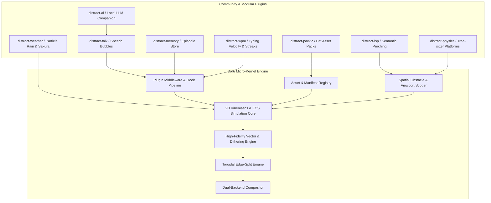

# `distract.nvim` — Unbuilt Features

Everything in this document is **not yet implemented**. Shipped work lives in
[`CHANGELOG.md`](CHANGELOG.md); the design of what shipped lives in
[`docs/superpowers/specs/`](docs/superpowers/specs/); the execution plan for this
document is
[`docs/superpowers/plans/2026-08-16-future-roadmap-master.md`](docs/superpowers/plans/2026-08-16-future-roadmap-master.md).

A section leaves this file when it is implemented on both backends, tested,
documented in `doc/distract.txt`, and listed in the changelog.

**Already built, deliberately absent below:** the asset provider API
(`register_asset`), the analytical shading model, multi-point lighting, 4×4 Bayer
dithering, the `spark`/`arc`/`limb`/`orb` sub-pixel primitives, parametric
kinematics (locomotion classes, `sine`/`orbital`/`lissajous`/`bezier` paths,
ballistic arcs, capability gating), the placement vocabulary (anchors, floors,
`z`, parallax), the kitty graphics backend, and GIF assets on every backend.

---

## 1. Strategic Architecture: Micro-Kernel Core & Plugin Ecosystem

The core stays focused on 2D sprite simulation, physics, sub-pixel shading and
dual-backend compositing. Every domain feature arrives through an extension point.
One of the three exists (`register_asset`); the other two are §2.1 and §2.2 below.



---

## 2. Core Extension APIs

### 2.1 Middleware & Lifecycle Hook Pipeline

Plugins subscribe to engine lifecycle events, mutate simulation state, intercept
state transitions, or inject custom rendering layers.

```lua
distract.register_plugin("my-plugin", {
  --- Called once when the plugin is registered or engine starts
  on_init = function(world) end,

  --- Called every simulation tick (30/60 FPS)
  --- @param entity table live entity state
  --- @param dt number delta time in seconds
  on_tick = function(entity, dt) end,

  --- Called when an entity transitions between states
  --- @param entity table
  --- @param from_state string
  --- @param to_state string
  on_state_change = function(entity, from_state, to_state) end,

  --- Called when an entity hits screen boundaries or solid obstacles
  --- @param entity table
  --- @param collision_info table { edge = "top"|"bottom"|"left"|"right"|"obstacle", target = table|nil }
  on_collision = function(entity, collision_info) end,

  --- Called when editor autocommands fire (debounced)
  --- @param event_name string "typing"|"moving"|"scrolling"|"idle"
  --- @param context table { cursor_col = number, cursor_row = number, buf = number }
  on_editor_event = function(event_name, context) end,

  --- Called when engine is stopped or reset
  on_teardown = function() end,
})
```

**Open decision — cross-engine parity.** These hooks run in Lua. `engine/src/ecs.rs`
has no plugin system, so a hook that mutates physics makes one manifest behave
differently on each backend. Either mutation is restricted to non-physics fields,
or plugins are declared halfblock/kitty-only. Settle this before writing code.

**Also unsettled:** hook failure policy (proposal: `xpcall`, report once, disable
that plugin), dispatch ordering (proposal: registration order), and how a plugin
marks the world dirty so `is_quiescent()` does not suppress its redraw.

---

### 2.2 Spatial Obstacle & Solid Platform Provider

Lets plugins register physical bounding boxes for entities to land on, walk
across, or avoid.

```lua
distract.register_obstacle_provider(function(win_id, buf_id)
  return {
    { x = 10, y = 15, width = 40, height = 1, type = "solid_platform" },
    { x = 0,  y = 25, width = 80, height = 1, type = "hazard" },
  }
end)
```

**Constraint:** obstacles are collected in Lua and pushed over IPC, exactly as
`events.sync_floor` pushes the floor to both engines. Neither engine collects its
own — that is the divergence class the physics parity harness exists to catch.

**Constraint:** a provider is called on a debounced cadence (`TextChanged`,
`WinScrolled`, window lifecycle), never per tick per entity. A Tree-sitter query
per frame is a performance trap.

---

## 3. Asset Fidelity: Silhouette-First Redo

The shading engine is built; the art it produces does not read at sprite size.
At 24×16 sprite pixels the half-block grid is 24 columns by **8 rows**, and
`sprite_gen.orb` spends five lighting terms across a body twelve pixels wide. The
cat currently reads as a fox: ears are 3-pixel stubs (`cat.lua`,
`EAR_HALF = {0,1,1}`), the four legs are identical capsules, whiskers and muzzle
sit below the resolution floor.

**Objective:** compact, iconic, high-contrast silhouettes — flat fills, a 1px dark
contour, 2–3 tone bands. Recognisable at a glance without overwhelming editor text.

**Scope:** every asset, existing and future. Not the cat alone.

**Blocked on an art-parity harness.** The same art exists twice
(`lua/distract/sprites/*.lua`, `engine/src/sprites/*.rs`) with no automated parity
test between them; `engine/tests/parity_dump.rs` is `#[ignore]` and dumps geometry,
not colour. Three assets × two implementations is six files that drift the moment
one is touched. Build `validate_sprite_parity` first — §5.7 also names it as an
MCP tool, so build it as a library function and wrap it there.

**Secondary win:** 1,909 global highlight groups exist for the three built-in
assets. A quantised palette should cut that by roughly 40×.

### Target asset specifications

| Asset | Dimensions | Reads as |
|---|---|---|
| 🐱 **Cat** | 24 × 16 px | Upright differentiated ears, distinct fore/hind leg silhouette, tail as the primary motion cue |
| 🦀 **Crab** | 24 × 16 px | Wide carapace, articulated pincers readable as pincers, eyestalks above the shell line |
| ☀️ **Sun** | 16 × 16 px | Clean disc, coronal rays that read at 8 rows, eclipse silhouette distinguishable from the shining pose |

---

## 4. Core Engine Enhancements

### 4.1 Buffer-Constrained & Scoped Viewport Positioning

- **Objective:** constrain sprite movement to the text area of the active buffer
  window, avoiding overlap with floating popups (LSP hover, Telescope, which-key,
  completion menus) and embedded terminal splits.
- **Configuration API:**
  ```lua
  require("distract").setup({
    positioning = {
      scope = "buffer", -- "buffer" | "window" | "editor" | "absolute"
      exclude_floating = true,
      exclude_filetypes = { "toggleterm", "lazy", "TelescopePrompt", "fzf", "help" },
      z_index_offset = 40, -- lower than LSP hover/cmp (50+)
    },
  })
  ```
- **In-terminal (`lua/distract/renderer.lua`):** resolve the rect from
  `nvim_win_get_position` and `nvim_win_get_width`, bind floats with
  `relative = "win"`, clamp against the rect rather than the editor grid.
- **Overlay (`engine/src/ecs.rs`):** synchronise the clipping rect over JSON-RPC
  via `UpdateViewportScope`.
- **Naming:** `z_index_offset` is Neovim float stacking. The existing `z` is depth
  and parallax. Two different numbers — do not conflate them.

---

### 4.2 Application & Instance Visibility Scoping

- **Objective:** sprites currently render over other applications, split panes and
  separate Neovim instances when the owning instance loses focus.
- **Instance-restricted (new default):** hide and stop drawing on `FocusLost`.
  The simulation keeps stepping — an entity mid-wrap must not be stranded, the same
  reason `is_quiescent` gates redraw and never the step.
- **Global rendering (opt-in):** a `restrict_to_instance = false` flag keeps today's
  full-screen behaviour, so the engine stays reusable for standalone desktop
  animation outside Neovim.
- **Implementation:** `FocusGained`/`FocusLost` in the existing `DistractEvents`
  group plus split-pane visibility checks; a suspend/resume command over IPC.

---

### 4.3 Seamless Toroidal Edge-Splitting & Continuous Screen Wrap

- **Objective:** when a sprite crosses an edge, the departing slice is
  simultaneously drawn at the complementary coordinate on the opposite boundary.
  `wrap_mode == "wrap"` teleports today, so the sprite pops.
- **Visual mechanics:**
  ```
         Top Edge (y = 0)
     ┌───────────────────────┐
     │       ▲  (Lower 70% of sprite visible at top)
     │     ( o.o )           │
     │                       │  <--- Editor Viewport
     │                       │
     │      /\_/\            │
     │       ▼  (Upper 30% of sprite simultaneously appears at bottom)
     └───────────────────────┘
       Bottom Edge (y = lines)
  ```
- **In-terminal (`lua/distract/renderer.lua`):** a second surface for the wrapped
  slice, slicing line strings and highlights at the offset.
- **GPU overlay (`engine/src/gpu.rs`):** detect bounding-quad intersections and
  emit 2 or 4 `SpriteInstance` quads with scaled UVs in a **single** instanced draw.
- **Hard parts:** four corners need four quads — test the corner first. The
  renderer already splits vertically between the extmark overlay and the float, so
  a horizontally-wrapped sprite can need both, twice; `M.place_surface` is where
  this lands and `renderer.lua` is already 501 lines, so budget the extraction.
  Kitty must revisit its deliberate no-placement-ids decision, since one image now
  genuinely appears twice at the same scale. Parallax scales the footprint, so the
  split point is computed on the scaled size, not the manifest's.

---

## 5. Ecosystem Plugins

Each is a separate repository depending only on the published core surfaces.
Nothing here adds a file under `lua/distract/`.

### 5.1 Contextual Dialogue & Speech Bubbles (`distract-talk`)

- **Objective:** floating dialogue balloons above companions with contextual tips,
  banter and reactions.
- **Bubble art:**
  ```
     ╭────────────────────────────╮
     │ Hope you're writing tests? │
     ╰────────────╮───────────────╯
                  ▼
             /\_/\   (Cat Sprite)
            ( o.o )
  ```
- **Triggers:**
  - `on_save_untested`: file saved with no matching test file (`*_spec.lua`,
    `*_test.go`, `*.test.ts`).
  - `on_git_churn`: high editing velocity with repeated undos/deletions.
  - `on_long_idle`: friendly reminder after 15 minutes of inactivity.
  - `on_lsp_error`: reaction to a diagnostic spike.
- **Requires:** §2.1 hooks and §4.1 viewport scoping. The bubble must never cover
  the cursor line, `pumvisible()`, or a floating window.
- **Exposes:** `say(entity_id, text, opts)` — §5.6 streams into it. Text is wrapped
  and length-bounded; an unbounded model response is a DoS on the renderer.

---

### 5.2 Persistent Episodic Memory (`distract-memory`)

- **Objective:** privacy-first storage of editing sessions, language exposure and
  milestones, so companions can reference history.
- **Storage:** `vim.fn.stdpath("data") .. "/distract/memory.json"`
- **Schema:**
  ```json
  {
    "version": 1,
    "history": {
      "first_seen_timestamp": 1773000000,
      "last_session_timestamp": 1773598000,
      "total_sessions": 24,
      "languages_spoken": {
        "lua": { "file_count": 42, "last_edited": 1773598000 },
        "rust": { "file_count": 18, "last_edited": 1773590000 }
      },
      "milestones": [
        { "id": "first_rust_file", "achieved_at": 1773590000 },
        { "id": "marathon_session_3h", "achieved_at": 1773500000 }
      ]
    }
  }
  ```
- **Contextual greetings:** *"It's been 12 days! Welcome back."* / *"Oh, I've never
  seen you write Rust before!"* / *"You've been hacking for 3 hours, remember to
  hydrate!"*
- **Constraints:** no file paths and no file contents ever enter the store —
  language names and counts only. Atomic write (temp + rename). A `version` bump
  gets a migration function, not a runtime branch. `milestones` and
  `languages_spoken` are capped. Time is injected, never read inside logic.

---

### 5.3 Semantic LSP Pathfinding & Companion Accompaniment (`distract-lsp`)

- Query `textDocument/documentSymbol` for function headers, classes and structs as
  perch points, registered through §2.2.
- **4-quadrant spatial planner:** score Top-Right, Direct-Right, Direct-Left and
  Bottom-Right for non-occlusion against the cursor line, diagnostic underlines and
  `pumvisible()`.
- **Diagnostic reactions:** error spikes trigger startled states — cat leaps, crab
  snaps pincers defensively.
- Requests are async and cancellable; a request in flight when the buffer changes is
  cancelled, not awaited. A missing LSP client is empty data, not failure — no warning.

---

### 5.4 Tree-sitter Code Physics & Solid Platforms (`distract-physics`)

- Tree-sitter detects function headers, markdown dividers (`---`) and closed folds.
- Each becomes a `solid_platform` rect through §2.2.
- The cat or crab walks across function definitions and falls between indented gaps.
- Fold state and buffer edits invalidate the cache. A missing parser is a no-op.

---

### 5.5 Ambient Weather & Particle Systems (`distract-weather`)

- 🌧️ **Rain & thunderstorms:** density scales with git diff size; lightning on
  syntax errors.
- 🌸 **Falling sakura petals:** drift responds to scroll momentum.
- ❄️ **Snow accumulation:** flakes settle on the statusline or bottom divider.
- 💻 **Matrix digital rain:** falling katakana/alphanumeric glyphs for focus sessions.

**Blocking question — measure before building.** The ECS was built for three
entities; weather wants hundreds. Benchmark 200 entities through one tick first. If
per-entity cost misses the frame budget, this starts with a batched particle path
(one entity owning a particle array) — which is a **core** change, not a plugin
change. Particles must also respect §4.1's rect and §4.3's wrap, or rain falls
outside the buffer.

---

### 5.6 Local LLM Companion Brain (`distract-ai`)

- **Objective:** connect companions to local lightweight models (SmolLM, Qwen 2.5
  0.5B, Ollama) for pair-programming comments.
- **Workflow:** on test failure or diagnostic burst, pass a concise prompt plus
  error snippet to the local endpoint; stream a one-sentence response into §5.1's
  bubble; fully offline, non-blocking, via `vim.uv`.
- **Hard requirements:**
  - **Local endpoint only.** A configured non-localhost endpoint is refused at
    startup with an explicit error. No hosted API, no key handling, no telemetry.
  - **Off by default, explicit opt-in.** Sending code to any model is the user's
    decision.
  - **Prompt is bounded and redacted.** An error snippet, not the buffer. Character
    cap documented. File paths never sent.
  - **Failure is silence.** Endpoint down, model missing or timeout produces no
    bubble, one `WARN`, and no retry storm.
  - **Output truncated** at a documented length before it reaches the bubble.

---

### 5.7 Asset Generation MCP Server (`distract-sprite-craft`)

Tooling for agents and developers building procedural sprites. Depends on §3's
harness.

- `create_sprite_asset` — generate pose curves, shading parameters, a manifest.
- `validate_sprite_parity` — **wraps §3's harness; does not reimplement it.**
- `preview_sprite_terminal` — half-block ANSI frames into the agent console.

Runs standalone without Neovim.

---

### 5.8 Gamification, WPM Momentum & Streaks (`distract-wpm`)

- **Hypersprint:** sustained 80+ WPM makes the sprite sprint with a particle trail —
  gated on §5.5's particle decision.
- **Pomodoro pet:** focus pose during work sprints, celebration animation on
  completion.
- WPM is computed from an injected clock over a rolling `TextChangedI` window.

---

## 6. Roadmap

Three entry points have no dependencies and can run in parallel: the on-screen
verification of what already shipped, §2.1 hooks, and §4.1 viewport scoping.

```
+-----------------------------------------------------------------------------------------------+
| PHASE 1: VERIFY WHAT SHIPPED, THEN THE KERNEL SURFACES                                        |
| - On-screen verification: kitty backend, GIF assets, gravity, animation fidelity              |
| - §3 Art-parity harness (validate_sprite_parity), then the silhouette-first redo              |
| - §2.1 Plugin & middleware hook pipeline  (settle the parity decision first)                  |
| - §4.1 Buffer-scoped viewport clipping & floating-window exclusion                            |
+-----------------------------------------------------------------------------------------------+
                                                │
                                                ▼
+-----------------------------------------------------------------------------------------------+
| PHASE 2: SPATIAL CORE & FIRST SATELLITES                                                      |
| - §4.2 Instance visibility scoping (focus-aware rendering)                                    |
| - §2.2 Spatial obstacle & solid platform provider                                             |
| - §4.3 Toroidal edge-splitting & continuous wrap (dual surface / GPU quad instances)          |
| - §5.1 `distract-talk`   - §5.2 `distract-memory`                                             |
+-----------------------------------------------------------------------------------------------+
                                                │
                                                ▼
+-----------------------------------------------------------------------------------------------+
| PHASE 3: CODE-AWARE SEMANTICS & AMBIENT SYSTEMS                                               |
| - §5.3 `distract-lsp`    - §5.4 `distract-physics`                                            |
| - §5.5 `distract-weather` (benchmark particles first)  - §5.8 `distract-wpm`                   |
+-----------------------------------------------------------------------------------------------+
                                                │
                                                ▼
+-----------------------------------------------------------------------------------------------+
| PHASE 4: AI BRAIN & AGENT TOOLING                                                             |
| - §5.6 `distract-ai`     - §5.7 `distract-sprite-craft` MCP server                             |
+-----------------------------------------------------------------------------------------------+
```
